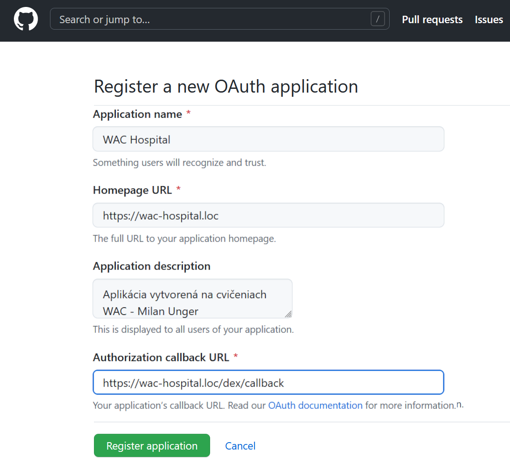

## Autentifikácia používateľov pomocou OpenID Connect

V tejto kapitole si ukážeme, ako zabezpečiť identifikáciu používateľov pomocou protokolu [OpenID Connect](https://openid.net/connect/). Nebudeme tu vykonávať autorizáciu používateľov, teda nebudeme ešte riadiť prístup používateľov k jednotlivým zdrojom, len zabezpečíme, že všetci používatelia pristupujúci do klastra sa musia identifikovať a to tak, aby sme vedeli jednoznačne určiť ich identitu. Ako poskytovateľa identít použijeme platformu [GitHub](https://github.com/), ale obdobným spôsobom by sme mohli použiť aj iných poskytovateľov identít, ako napríklad Google, Microsoft, Facebook, a podobne. Pokiaľ by sme si chceli zriadiť vlastného poskytovateľa identít, mohli by sme zaintegrovať do nášho systému niektorú z implementácií [Identity Provider](https://en.wikipedia.org/wiki/Identity_provider) služby. V oblasti menších projektov je napríklad populárna implementácia [dex](https://dexidp.io/), ale k dispozícii je [mnoho ďalších implementácií a knižníc](https://openid.net/developers/certified/).

Pre účely autentifikácie použijeme službu [oauth2-proxy](https://oauth2-proxy.github.io/oauth2-proxy/) a postupne nakonfigurujeme [Envoy Gateway] tak, aby túto službu použila na overovanie identity asociovanej so vstupnou požiadavkou.

1. Dôležitým aspektom protokolu OIDC je predpoklad použitia štandardného prehliadača odolného voči rôznym bezpečnostným útokom. Prehliadač plní v protokole [Open ID Connect](https://openid.net/developers/how-connect-works/) dôležitú úlohu a naviguje používateľa medzi rôznymi poskytovateľmi - webová aplikácia, poskytovateľ identít, poskytovateľ chránených zdrojov. Protokol predpokladá vytvorenie viacstranného kontraktu medzi jednotlivými entitami. V tomto prostredí je preto potrebné používať jednoznačné označenia entít, čo neplatí pre doménu `localhost`, ktorá označuje akýkoľvek výpočtový prostriedok.  

   Nášmu lokálnemu počítaču musíme preto priradiť iné označenia, taskzvaný [_Fully Qualified Domain Name (FQDN)_](https://sk.wikipedia.org/wiki/Presne_stanoven%C3%A9_meno_dom%C3%A9ny). V kapitole [Bezpečné pripojenie k aplikácii protokolom HTTPS](./040-secure-connection.md) sme k objektu `wac-hospital-gateway` priradili meno `wac-hospital.loc`. Týmto menom budeme označovať náš lokálny klaster, musíme ešte vytvoriť doménové meno pre náš počítač.

   Zistite IP adresu, ktorá je vášmu počítaču priradená, napríklad príkazom `ipconfig`, alebo `ifconfig` v prípade OS Linux. Otvorte súbor `C:\Windows\System32\drivers\etc\hosts` (`/etc/hosts` na systémoch linux) a vytvorte v ňom nový záznam

   ```plain
   <vaša IP adresa> wac-hospital.loc
   ```

   Súbor uložte - budete vyzvaný na prechod do privilegovaného módu, respektíve musíte tento súbor otvoriť a upraviť s administrátorskými oprávneniami.

   >warning:> IP adresa pridelená Vášmu počítaču sa môže zmeniť, pri každom ďalšom sedení preto musíte overiť, aká IP adresa je vášmu počítaču pridelená a zmeniť záznam v tomto súbore. V niektorých sieťach majú jednotlivé zariadenia, vrátane pracovných počítačov, pridelené stále FQDN. V týchto prípadoch môžete použiť toto označenie a nemusíte upravovať súbor `etc/hosts`. Použitie označenia `localhost` v ďalšom cvičení ale nebude fungovať.

2. Aby sme získali prístup k identite používateľov platformy GitHub, musíme na tejto platforme zaregistrovať našu aplikáciu. Používatelia budú neskôr vyzvaní na poskytnutie súhlasu so zdieľaním ich identity s našou aplikáciou. Prihláste sa so svojim účtom do platformy GitHub a prejdite na stránku [https://github.com/settings/developers](https://github.com/settings/developers). Zvoľte voľbu _New OAuth app_. Vyplňte formulár na zobrazenej stránke:

   * _Application name_: `WAC hospital`
   * _Homepage URL_: `https://wac-hospital.loc`
   * _Application description_: `Aplikácia vytvorená na cvičeniach WAC - <vaše meno>`
   * _Authorization callback URL_: `https://wac-hospital.loc/dex/callback`

   Prvé tri položky budú prezentované používateľom pri poskytovaní súhlasu so zdieľaním informácií. Posledná položka je dôležitá v samotnom protokole OIDC - používatelia budú po autentifikácii na stránke GitHub presmerovaní jedine na túto URL, a poskytovateľ identít akceptuje jedine požiadavky o autentifikovanie používateľov, ktoré presmerujú používateľa na niektorú z registrovaných _authorization callback_ URL. Týmto spôsobom je zabránené, aby sa škodlivá stránka mohla vydávať za vašu aplikáciu a získať prístup k údajom používateľa bez jeho predchadzajúceho súhlasu.

   

   Po vyplnení stlačte ovládací prvok  _Register Application_ a na ďalšej stránke stlačte na ovládací prvok _Generate a new client secret_. Poznačte si identifikátor klienta - _Client ID_, a zobrazené heslo - _Client Secret_. Nakoniec stlačte tlačidlo _Update application_.

   >info:> Návody a odkazy na konfiguráciu použitej služby s inými poskytovateľmi identít nájdete [tu](https://oauth2-proxy.github.io/oauth2-proxy/configuration/providers/).

3. Vytvorte súbor `${WAC_ROOT}/ambulance-gitops/clusters/localhost/secrets/params/oidc-client.env` s nasledujúcim obsahom (musíte použiť hodnoty špecifické pre vašu individuálnu konfiguráciu):

    ```env
    client-id=<client id z kroku 2>
    client-secret=<client secret z kroku 2>
    ```

   Otvorte okno príkazového riadku a prejdite do adresára `${WAC_ROOT}/ambulance-gitops/clusters/localhost/secrets/params`. Zašifrujte _Secret_ pomocou príkazu

   ```powershell
   sops --encrypt --in-place oidc-client.env
   ```

   Upravte súbor `${WAC_ROOT}/ambulance-gitops/clusters/localhost/secrets/kustomization.yaml` a pridajte do neho vytvorenie nového objektu typu [_Secret_](https://kubernetes.io/docs/concepts/configuration/secret/)

   ```yaml
   ...
   secretGenerator:
     - name: repository-pat
       ...
     - name: mongodb-auth
       ...
     - name: oidc-client     @_add_@
       type: Opaque     @_add_@
       envs:     @_add_@
         - params/oidc-client.env     @_add_@
       options:     @_add_@
           disableNameSuffixHash: true     @_add_@
   ```

4. GitHub neposkytuje OIDC protokol priamo, ale podporuje štandardný protokol [OAuth2](https://oauth.net/2/), ktorý je základom OIDC. Na premostenie tejto nekompatibility použijeme službu [Dex](https://dexidp.io/), ktorá poskytuje OIDC rozhranie nad rôznymi poskytovateľmi identít, vrátane GitHubu.

   Vytvorte súbor `${WAC_ROOT}/ambulance-gitops/infrastructure/dex/deployment.yaml` s nasledujúcim obsahom

   ```yaml
   apiVersion: apps/v1
   kind: Deployment
   metadata:
     name: dex
   spec:
     replicas: 1
     selector:
       matchLabels:
         app: dex
     template:
       metadata:
         labels:
           app: dex
       spec:
         serviceAccountName: dex  @_important_@
         containers:
         - name: dex
           image: ghcr.io/dexidp/dex:v2.45.1
           args: ["dex", "serve", "/etc/dex/cfg/config.yaml"] @_important_@
           ports:
           - name: http
             containerPort: 5556
           env:
           - name: GITHUB_CLIENT_ID @_important_@
             valueFrom:
               secretKeyRef:
                 name: oidc-cliet @_important_@
                 key: client-id
           - name: GITHUB_CLIENT_SECRET @_important_@
             valueFrom:
               secretKeyRef:
                 name: oidc-client @_important_@
                 key: client-secret
           volumeMounts:
           - name: config
             mountPath: /etc/dex/cfg
         volumes:
         - name: config
           configMap:
             name: dex-config @_important_@
   ```

   Všimnite si, že v tejto konfigurácii referencujeme hodnoty z _Secret_-u `oidc`, ktorý sme vytvorili v    predchádzajúcom kroku. V tejto konfigurácii sme použili aj _ConfigMap_ `dex-config`, ktorú vytvoríme v ďalšom kroku    a ktorá obsahuje konfiguračný súbor služby [Dex](https://dexidp.io/docs/configuration/).

   Ďalej vytvorte súbow `${WAC_ROOT}/ambulance-gitops/infrastructure/dex/service.yaml` s obsahom

   ```yaml
   apiVersion: v1
   kind: Service
   metadata:
     name: dex
   spec:
     selector:
       app: dex
     ports:
     - protocol: TCP
       port: 5556
       targetPort: 5556
   ```

   Službu Dex potrebuje sprístupniť aj pre externý prístup keďže bude obsluhovať komunikáciu OAuth2 protokolu so    serverom GitHub. Vytvorte súbor `${WAC_ROOT}/ambulance-gitops/infrastructure/dex/http-route.yaml` s obsahom

   ```yaml
   kind: HTTPRoute
   metadata:
     name: dex
   spec:
     parentRefs:
       - name: wac-hospital-gateway
         sectionName: fqdn
     rules:
       - matches:
           - path:
               type: PathPrefix
               value: /dex
   
         backendRefs:
           - group: ""
             kind: Service
             name: dex
             port: 5556
   ```

   V tomto prípade sme nakonfigurovali túto route len pre listnera "fqdn", to znamená, že služba Dex bude    prostredníctvom https protokolu.

   Po overení používateľa bude Dex spravovať lokálne sedenia (_sessions_). V našej konfigurácii k tomu bude používať    vlastné definície kubernetesu, a k tomu potrebuje oprávnenia na ich vytváranie a mazanie. Vytvorte súbor `$   {WAC_ROOT}/ambulance-gitops/infrastructure/dex/rbac.yaml` s obsahom

   ```yaml
   apiVersion: v1
   kind: ServiceAccount
   metadata:
     name: dex @_important_@
   ---
   apiVersion: rbac.authorization.k8s.io/v1
   kind: ClusterRole
   metadata:
     name: dex
   rules:
   - apiGroups: ["dex.coreos.com"] @_important_@
     resources: ["*"]
     verbs: ["*"]
   - apiGroups: ["apiextensions.k8s.io"]
     resources: ["customresourcedefinitions"]
     verbs: ["list", "get", "create", "update"]  @_important_@
   ---
   apiVersion: rbac.authorization.k8s.io/v1
   kind: ClusterRoleBinding
   metadata:
     name: dex
   roleRef:
     apiGroup: rbac.authorization.k8s.io
     kind: ClusterRole
     name: dex
   subjects:
   - kind: ServiceAccount
     name: dex
     namespace: wac-hospital
   ```

   Teraz vytvorte súbor `${WAC_ROOT}/ambulance-gitops/infrastructure/dex/config.yaml` s obsahom

   ```yaml
   
   issuer: https://wac-hospital.loc/dex  # URL, kde pobeží Dex @_important_@
   storage:
     type: kubernetes
     config:
       inCluster: true
   oauth2:
     skipApprovalScreen: true
   web:
     http: 0.0.0.0:5556
   
   connectors:  # GitHub OAuth provider
   - type: github
     id: github
     name: GitHub
     config:
       clientID: $GITHUB_CLIENT_ID  @_important_@
       clientSecret: $GITHUB_CLIENT_SECRET  @_important_@
       redirectURI: https://wac-hospital.loc/dex/callback  @_important_@
   
   staticClients:  # WAC hospital client of Dex
   - id: envoy-gateway
     redirectURIs:
     - 'https://wac-hospital.loc/authn/callback' @_important_@
     name: 'Envoy Gateway'
     secret: envoy-gateway-secret-265305158967 @_important_@
   
   telemetry:
     tracing:
       enabled: false
       
   ```
  
   Nakoniec tieto súbory zintegrujeme pomocou súboru `${WAC_ROOT}/ambulance-gitops/infrastructure/dex/kustomization.   yaml`
  
   ```yaml
   apiVersion: kustomize.config.k8s.io/v1beta1
   kind: Kustomization
   
   namespace: wac-hospital
   commonLabels:
     app.kubernetes.io/component: dex
   
   resources:
   - deployment.yaml
   - service.yaml
   - http-route.yaml
   - rbac.yaml
   
   configMapGenerator:
   - name: dex-config
     files:
     - config.yaml
   ```

   a upravíme súbor `${WAC_ROOT}/ambulance-gitops/clusters/localhost/prepare/kustomization.yaml` a doplníme referenciu na túto službu

   ```yaml
   ...
   resources:
   ...
   - ../../../infrastructure/dex @_add_@
   ...
   ```

5. Aby sme mohli vyššie nakonfigurovanú službu využiť, musíme upraviť konfiguráciu [Envoy Gateway]. Z technického hľadiska implementuje [Envoy Gateway] návrhový vzor [Kubernetes Controller](https://kubernetes.io/docs/concepts/architecture/controller/) - sleduje zmeny v registrovaných objektoch skupiny [Gateway API] a následne vytvorí novú inštanciu služby [Envoy Proxy], ktorej konfigurácia je určená na základe registrovaných zdrojov. [Envoy Proxy] je vysoko efektívna implementácie reverznej proxy, ktorá umožňuje konfigurovať detaily spracovania a smerovania požiadaviek do klastra (tu vo všeobecnom zmysle klastra výpočtových prostredkov, nie je limitovaná len na kubernetes klaster).

   Jedným z objektov podporovaných [Envoy Gateway] je objekt typu [_SecurityPolicy_](https://gateway.envoyproxy.io/docs/api/extension_types/#securitypolicy). Tento využijeme na konfiguráciu authentifikácie pomocou OIDC. Taktiež z výsledného JWT tokenu získame informácie o používateľovi a umiestnime ich do hlavičiek ktoré budeme ďalej preposielať našim službám.

   Vytvorte súbor `${WAC_ROOT}/ambulance-gitops/infrastructure/envoy-gateway/authn.security-policy.yaml` s obsahom

   ```yaml
   apiVersion: gateway.envoyproxy.io/v1alpha1
   kind: SecurityPolicy
   metadata:
     name: authn
     namespace: wac-hospital
   spec:
       targetRefs:
       - group: gateway.networking.k8s.io
         kind: Gateway
         name: wac-hospital-gateway
         sectionName: fqdn
   
       oidc:
         provider:
           issuer: https://wac-hospital.loc/dex
           authorizationEndpoint: https://wac-hospital.loc/dex/auth
           tokenEndpoint: http://dex.wac-hospital:5556/dex/token
         clientIDRef:
           name: oidc-dex
         clientSecret:
           name: oidc-dex
         redirectURL: https://wac-hospital.loc/authn/callback
         forwardAccessToken: true
         cookieNames:
           idToken: wac-hospital-id-token
           accessToken: wac-hospital-access-token
         scopes:
         - profile
         - email
         - openid
         - federated:id
       jwt:
         optional: false
         providers:
         - claimToHeaders:
           - claim: name
             header: x-forwarded-preferred-username
           - claim: name
             header: x-forwarded-user
           - claim: email
             header: x-forwarded-email
           extractFrom:
             cookies:
             - wac-hospital-id-token
           name: dex-sso
           remoteJWKS:
             uri: http://dex.wac-hospital:5556/dex/keys
   ---
   apiVersion: gateway.envoyproxy.io/v1alpha1
   kind: SecurityPolicy
   metadata:
     name: dex-bypass-authn
     namespace: wac-hospital
   spec:
       targetRefs:
       - group: gateway.networking.k8s.io
         kind: HTTPRoute
         name: dex
   # Tato policy je viac špecifická (htt-route > gateway) 
   # a preto bude mať prednosť pred authn policy 
   #  v tomto pripade dovolime neauthentifikované požiadavky 
   # pre protokol oidc aby sme sa vyhli nekonečným presmerovaniam
   ```

   Všimnite si, že konfigurujeme dve špecifické _SecurityPolicy_ - `authn` a `dex-bypass-authn`. Prvá z nich je nakonfigurovaná tak, že všetky požiadavky smerujúce na gateway `wac-hospital-gateway` a listener `fqdn` musia být autentifikované pomocou OIDC protokolu. Druhá policy je nakonfigurovaná tak, že všetky požiadavky smerujúce na HTTPRoute `dex` (teda požiadavky smerujúce na službu Dex) nemusia být autentifikované. Táto druhá policy je potrebná, aby sme sa vyhli nekonečným presmerovaniam medzi Envoy Gateway a službou Dex, ktoré by vznikli v prípade, že by sme požiadavky smerujúce na Dex tiež museli autentifikovat. Máme k dispozícii rôzne techniky ako definovať kde authentifikáciu požadujeme a kde nie, napríklad by sme mohli použiť `targetSelector` a rôzne labely, alebo by sme mohli nakonfigurovať rôzne _Gateway_ objekty pre autentifikované a neautentifikované požiadavky. V tomto prípade nám ale stačí táto jednoduchá konfigurácia.

   V objekte _SecurityPolicy_ `authn` sme nastavili `redirectURL: https://wac-hospital.loc/authn/callback`, čo znamená, že po úspešnej autentifikácii bude používateľ presmerovaný na túto URL. Na tejto URL bude [Envoy Gateway] spracovávať OIDC callback a nastaví cookie s JWT tokenom, ktorý bude obsahovat informácie o identite používateľa. Následne bude požiadavka presmerovaná na pôvodne požadovaný zdroj. Hoci túto cestu obslúži interne inštancia [Envoy Proxy] vytvorená [Envoy Gateway], musíme aj pre ňu zadefinovať objekt typu _HTTPRoute_. Vytvorte súbor `${WAC_ROOT}/ambulance-gitops/infrastructure/envoy-gateway/oidc-callback.http-route.yaml` s obsahom

   ```yaml
   apiVersion: gateway.networking.k8s.io/v1
   kind: HTTPRoute
   metadata:
     name: oauth2-callback
     namespace: wac-hospital
   spec:
     parentRefs:
       - name: wac-hospital-gateway
         sectionName: fqdn
     rules:
   # authn callback je presmerovaný na interný envoy proxy
   # endpoint 
   # musíme ho ale definovať aby ho envoy gateway neodmietol
       - matches:
         - path:
             type: Exact
             value: /authn/callback
         filters:
         - type: RequestRedirect
           requestRedirect:
             path: 
               type: ReplaceFullPath
               replaceFullPath: /oauth2/callback
             statusCode: 302
    ```

   Nakoniec v súbore `${WAC_ROOT}/ambulance-gitops/infrastructure/envoy-gateway/kustomization.yaml` doplňte referenciu na nové súbory

   ```yaml
   ...
   resources:
   ...
   - authn.security-policy.yaml @_add_@
   - oidc-callback.http-route.yaml @_add_@
   ```

6. Vytvorte súbor `${WAC_ROOT}/ambulance-gitops/clusters/localhost/secrets/params/oidc-dex.env` s nasledujúcim obsahom (hodnoty odpovedajú hodnotam v súbore `config.yaml` služby Dex):

    ```env
    client-id: envoy-gateway
    client-secret: envoy-gateway-secret-265305158967 @_important_@
    ```

   Otvorte okno príkazového riadku a prejdite do adresára `${WAC_ROOT}/ambulance-gitops/clusters/localhost/secrets/params`. Zašifrujte _Secret_ pomocou príkazu

   ```powershell
   sops --encrypt --in-place oidc-dex.env
   ```

   Upravte súbor `${WAC_ROOT}/ambulance-gitops/clusters/localhost/secrets/kustomization.yaml` a pridajte do neho vytvorenie nového objektu typu [_Secret_](https://kubernetes.io/docs/concepts/configuration/secret/)

   ```yaml
   ...
   secretGenerator:
    
       ...
     - name: oidc-client
        ...
     - name: oidc-dex     @_add_@
       type: Opaque     @_add_@
       envs:     @_add_@
         - params/oidc-dex.env     @_add_@
       options:     @_add_@
           disableNameSuffixHash: true     @_add_@
   ```

7. Uložte zmeny a archivujte ich vo vzdialenom repozitári:

   ```ps
    git add .
    git commit -m "Add oauth2-proxy"
    git push
   ```

   Overte, že sa aplikujú najnovšie zmeny vo Vašom klastri

    ```ps
    kubectl -n wac-hospital get kustomization -w
    ```

    Overte, že stav objektu _Security Policy_ je `Accepted`.

    ```ps
    kubectl -n wac-hospital get securitypolicies -o=yaml
    ```

8. Otvorte v prehliadači novú záložku a otvorte _Nástroje pre vývojárov -> Sieť_.  V tejto záložke prejdite na stránku [https://wac-hospital.loc](https://wac-hospital.loc) a zvoľte voľbu _Protokol natrvalo_ (respektíve _Zachovať denník_). Nezabudnite, že v súbore `etc/host` musíte mať správne pridelenú IP adresu k záznamu `wac-hospital.loc`. Prehliadač vás upozorní na bezpečnostné riziko z dôvodu použitia neovereného TLS certifikátu. Zvoľte _Pokračovať_ a _Rozumiem bezpečnostnému riziku_.

    >build_circle:> V niektorých prípadoch môže byť voľba _Pokračovať_ nedostupná. V takom prípade ponechajte okno prehliadača ako aktívnu aplikáciu a na klávesnici vyťukajte `THISISUNSAFE`. Táto možnosť (_back-doors_) je v prehliadačoch Google ponechaná pre dobre informovaných profesionálov, akými sú napríklad softvéroví inžinieri.

    Následne budete presmerovaný na stránku GitHub, kde budete vyzvaný na udelenie súhlasu so zdieľaním vašich identifikačných údajov s aplikáciou _WAC Hospital_. Súhlas udeľte, po čom budete presmerovaný do aplikácie vo vašom klastri.

    Prezrite si záznam sieťovej komunikácie v _Nástroji vývojárov_. Môžete vidieť, ako je prehliadač niekoľkokrát presmerovaný medzi jednotlivými entitami OIDC protokolu. Časť protokolu pritom prebieha na pozadí medzi _OAuth2 Proxy_ a poskytovateľom identít Git Hub.

    _Dex_ si teraz bude pamätať Vaše prihlásenie počas nasledujúcich 168 hodín (platnosť cookie) a platforma GitHub si pamätá udelenie oprávnenia pre Vašu aplikáciu. Pri opätovnom načítaní preto budete automaticky presmerovaný na stránky aplikácie a iba pri dlhšom nepoužívaní aplikácie budete opätovne vyzvaný na prihlásenie. Alternatívne sa môžete skúsiť prihlásiť z nového súkromného okna prehliadača, ktoré nezdieľa vašu identitu (cookies a pod.) s ostatnými  oknami prehliadača.

9. Chceme ešte overiť či služby v našom klastri dostávajú správne nastavené hlavičky s identitou používateľa. Za týmto účelom doplníme do nášho klastra jednoduchú službu [http-echo](https://github.com/mendhak/docker-http-https-echo). Vytvorte súbor `${WAC_ROOT}/ambulance-gitops/apps/http-echo/deployment.yaml`

   ```yaml
   apiVersion: apps/v1
   kind: Deployment
   metadata:  
     name: http-echo
   spec:
     replicas: 1  
     selector:
       matchLabels:
         pod: http-echo
     template:
       metadata:
         labels: 
           pod: http-echo 
       spec:
         containers:
         - image: mendhak/http-https-echo
           name: http-echo        
           ports:
           - name: http
             containerPort: 8080
           resources:
             limits:
               cpu: '0.1'
               memory: '128M'
             requests:
               cpu: '0.01'
               memory: '16M'
   ```

   Vytvorte súbor `${WAC_ROOT}/ambulance-gitops/apps/http-echo/service.yaml`

   ```yaml
   apiVersion: v1
   kind: Service
   metadata:
     name: http-echo
   spec: 
     ports:
     - name: http
       port: 80
       protocol: TCP
       targetPort: 8080
   ```

   Vytvorte súbor `${WAC_ROOT}/ambulance-gitops/apps/http-echo/http-route.yaml`:

   ```yaml
   apiVersion: gateway.networking.k8s.io/v1
   kind: HTTPRoute
   metadata:
     name: http-echo
   spec:
     parentRefs:
       - name: wac-hospital-gateway
     rules:
       - matches:
           - path:
               type: PathPrefix
               value: /http-echo
         backendRefs:
           - group: ""
             kind: Service
             name: http-echo
             port: 80
    ```

    a súbor `${WAC_ROOT}/ambulance-gitops/apps/http-echo/kustomization.yaml`:

   ```yaml
   apiVersion: kustomize.config.k8s.io/v1beta1
   kind: Kustomization
   
   resources: 
   - deployment.yaml
   - service.yaml
   - http-route.yaml
   
   namespace: wac-hospital
   
   commonLabels: 
     app.kubernetes.io/component: http-echo
   ```

    a nakoniec v súbore `${WAC_ROOT}/ambulance-gitops/clusters/localhost/install/kustomization.yaml` doplňte referenciu na túto službu:

    ```yaml
    ...
    resources: 
    ...
    - ../../../apps/mongo-express
    - ../../../apps/http-echo @_add_@
    ...
    ```

   Uložte zmeny a archivujte ich vo vzdialenom repozitári:

   ```ps
    git add .
    git commit -m "Add http-echo"
    git push
   ```

   Overte, že sa aplikujú najnovšie zmeny vo Vašom klastri

    ```ps
    kubectl -n wac-hospital get pods -w
    ```

    Prejdite na stránku [https://wac-hospital.loc/http-echo](https://wac-hospital.loc/http-echo) a prezrite si vygenerovaný JSON súbor. V časti `headers` si všimnite hlavičky `x-forwarded-email`, a `x-forwarded-user`.

    > Odporúčame nainštalovať si do prehliadača niektorý z prídavkov pre zobrazovanie JSON súborov, ktorý je užitočným nástrojom pri vývoji webových aplikácií. Príkladom takéhoto rozšírenia pre prehliadač Chrome je napríklad [JSONFormatter](https://github.com/callumlocke/json-formatter)

Naša aplikácia je teraz schopná identifikovať používateľov.
