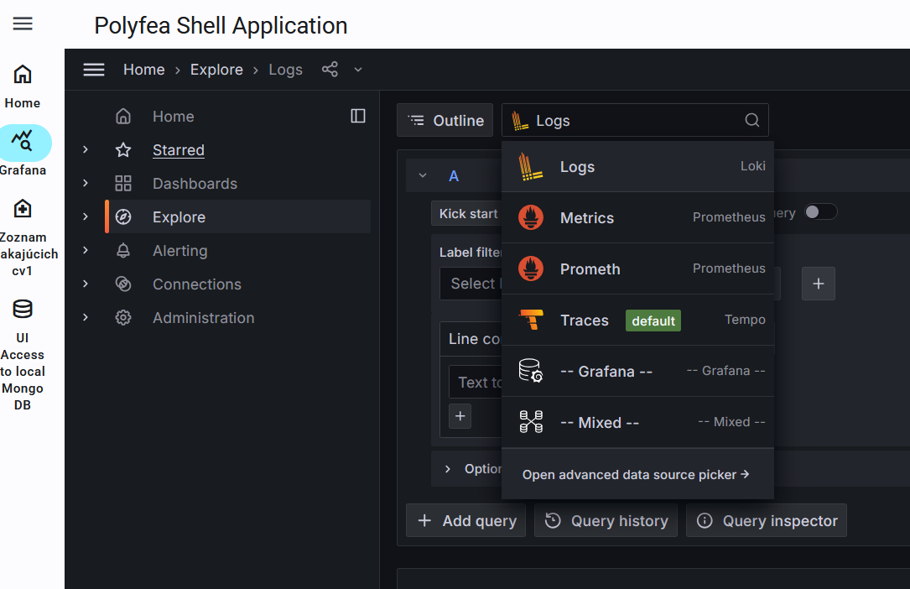
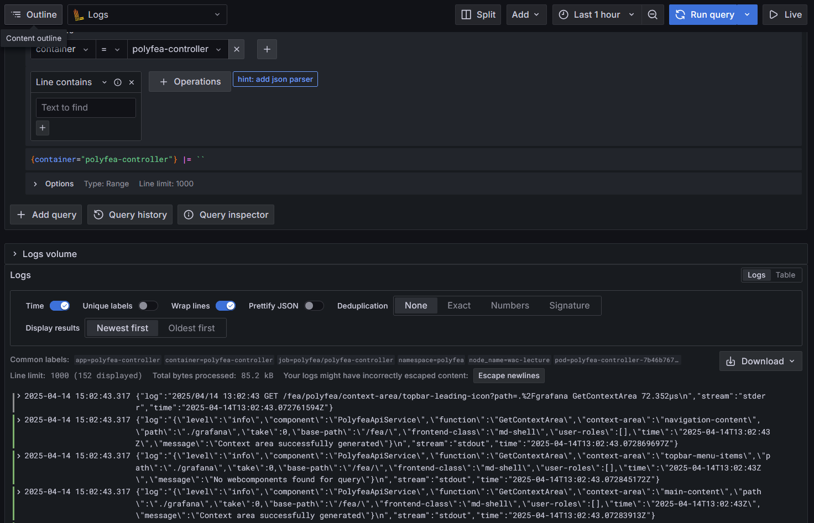
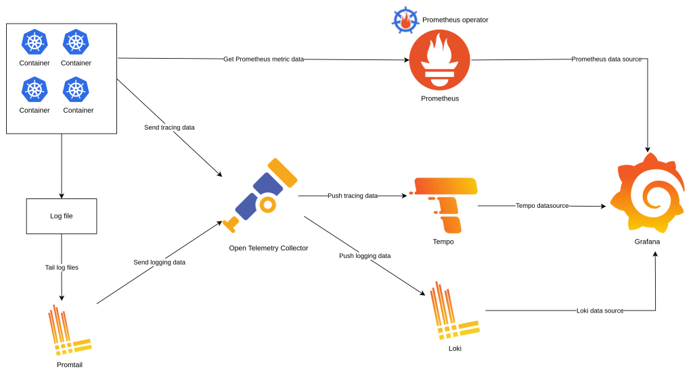

# Zber a analýza logov

Náš systém sa postupne rozrastá o nové mikroslužby, ktoré obsluhujú rôzne aspekty našej aplikácie. Zároveň predpokladáme rozrastanie sa aj samotnej funkcionality aplikácie, čo bude viesť k pridávaniu ďalších mikroslužieb do systému. Napriek všetkej snahe o dodanie čo najkvalitnejších komponentov, musíme predpokladať, že počas prevádzky systému bude dochádzať k situáciám, kedy sa správanie systému bude odchylovať od predpokladaného špecifikovaného správania. V takýchto situáciách je potrebné mať k dispozícii nástroje, ktoré nám umožnia zistiť, čo sa v systéme deje a kde sa nachádza problém. Zároveň potrebujeme mať k dispozícii informácie o tom, ako je súčasný systém využívaný a zaťažovaný, aby sme prípadným problémom dokázali včas predchádzať. V kontexte [DevOps](https://en.wikipedia.org/wiki/DevOps) vývoja sa tieto schopnosti a aktivity očakávajú od samotného vývojového tímu. V tejto a nasledujúcej časti si ukážeme, ako takéto nástroje nasadiť do systému a ako sledovanie (monitorovanie) systému podporiť aj pri implementácii mikroslužieb.

Na sledovanie činnosti systému budeme využívať systém [Grafana Stack](https://grafana.com/about/grafana-stack/) a systém/ knižnice [OpenTelemetry](https://opentelemetry.io/). [Open Telemetry] je dnes de facto štandardom v oblast monitorovanie a zberu údajov zo softvérových systémov. Systém [Grafana Stack] poskytuje nástroje na analýzy a vizualizáciu údajov, ako aj na ďaľšie spracovanie týchto údajov. Existuje viacero alternatívnych riešení k systému [Grafana Stack], za povšimnutie stojí napríklad systém [SigNoz](https://signoz.io/), alebo [Uptrace](https://github.com/uptrace/uptrace).

Pre nasadenie systému [Grafana Stack] sme pripravili manifesty, ktoré sú prispôsobené projektu týchto cvičení. Manifesty sú dostupné [tu](https://github.com/wac-fiit/manifests/tree/main/observability). Pre reálne nasadenie odporúčame naštudovať si aj oficiálnu dokumentáciu, pretože tu uvedená konfigurácia je optimalizované pre nasadenie na klastri s limitovanou kapacitou.

1. Vytvorte adresár `${WAC_ROOT}/ambulance-gitops/infrastructure/observability` a v ňom súbor `${WAC_ROOT}/ambulance-gitops/infrastructure/observability/kustomization.yaml`:

   ```yaml
   apiVersion: kustomize.config.k8s.io/v1beta1
   kind: Kustomization

   resources:
   - https://github.com/wac-fiit/manifests//observability/gitops?ref=main
   # in case your cluster is too small (e.g. not enough CPU/memory on laptop) you may 
   # use following line instead of the above one, 
   # to install only open Open*Telemetry Collector with exports into its log stream
   # - https://github.com/wac-fiit/manifests//observability/otel-collector-logging/gitops?ref=main

   # if you do not have yet certmanager installed: 
   #- https://github.com/wac-fiit/manifests//cert-manager/gitops?ref=main
   ```

   >info:> Predpokladáme, že `cert-manager` máte nainštalované z prechádzajúcej kapitoly. Ak nie, odkomentujte príslušný riadok v predchádzajúcom súbore.

   Následne otvorte súbor `${WAC_ROOT}/ambulance-gitops/clusters/localhost/prepare/kustomization.yaml` a upravte ho:

   ```yaml
   apiVersion: kustomize.config.k8s.io/v1beta1
   kind: Kustomization
   
   resources:
   - namespace.yaml
   - ../../../infrastructure/polyfea
   - ../../../infrastructure/fluxcd
   - ../../../infrastructure/envoy-gateway
   - ../../../infrastructure/observability @_add_@
     @_add_@
   configMapGenerator:  @_add_@
     - name: deployment-config   @_add_@
       namespace: observability  @_add_@
       behavior: merge  @_add_@
       options:  @_add_@
         disableNameSuffixHash: true  @_add_@
       literals:  @_add_@
       # for development purposes we use always_on sampler,   @_add_@
       # in production you may want to use parentbased_trace_id_ratio sampler or any other available  @_add_@
         - OTEL_TRACES_SAMPLER=always_on  @_add_@
         - LOG_LEVEL=debug  @_add_@
         - OTEL_TRACES_SAMPLER_RATIO=1.0 @_add_@
         - OTEL_TRACES_SAMPLER_PERCENTAGE=100 @_add_@
         # specify different host if `localhost` is not your top level domain name for the cluster @_add_@
         - GRAFANA_ROOT_URL:=http://localhost/grafana  @_add_@ 
     
   components:
   - ../../../components/version-developers
   ```

   Uložte zmeny a archivujte ich vo vzdialenom repozitári:

   ```ps
   git add .
   git commit -m "Add grafana stack"
   git push
   ```

   Overte, že sa aplikujú najnovšie zmeny vo Vašom klastri

   ```ps
   kubectl -n observability get kustomization -w
   ```

2. Po aplikovani zmien sa do klastra nainštalujú komponenty systému [Grafana Stack]. Otvorte v prehliadači stránku [http://localhost](http://localhost) a vyberte aplikáciu _Aktuálny operačný stav systému_. Pri správnej inštalácii by sa mala objaviť okno aplikácie Grafana s prednastaveným informačným panelom "System Overview".

   >build_circle:> V niektorých prípadoch, v závislosti od načasovania sa môže zobraziť informácia _Dashboard not found_. V takom prípade je potrebné počkať, kým sa nainštaluje systém [Grafana Stack] a znovu načítať stránku.

   V pravom hornom okne rámčeka Grafana kliknite na ikonu menu menu a v bočnom paneli stlačte na záložku _Explore_. V okne _Explore_ sa zobrazí zoznam dostupných zdrojov údajov. V hornej časti vyberte v rozbalovacom zozname položku "Logs".

   

3. V zobrazenok paneli zadajte do poľa _Label filters_ názov `container` a priraďte mu hodnotu `polyfea-controller` a v hornej časti stlačte modro sfarbené tlačidlo _Run query_. V spodnej časti okna sa zobrazí zoznam logov, ktoré boli zaznamenané v poslednej hodine kontajnermi s názvom `polyfea-controller`

   

   >keyboard:> Vyskúšajte si rôzne konfigurácie sledovania záznamov, napríklad pre `namespace=wac-hospital`, rôzne časové obdobie, prípadne filtrovanie záznamov so špecifickým textom alebo atribútom. Pre podrobnejšiu prácu si naštudujte aj dokumentáciu pre tvorenie dotazov [Log queries](https://grafana.com/docs/loki/latest/query/log_queries/).

Predchádzajúcim postupom sme do nášho systému nainštalovali systém [Grafana Stack] a [Open Telemetry Collector], čím sme pripravili sme si prostredie na sledovanie činnosti našich mikroslužieb. Schématicke znázornenie ako tento systém funguje je na nasledujúcom obrázku:



V tejto kapitole využívame subsystém [Promtail](https://grafana.com/docs/loki/latest/send-data/promtail/), ktorého úlohou je zozbierať všetky logy z kontajnerov v systéme kubernetes a poslať ich do subsystému _Loki_, ktorý ich uloží do databázy. Následne je možné tieto logy analyzovať pomocou aplikácie _Grafana_.

Pokiaľ by sme chceli sledovať činnosť našej aplikácie v kontajneri `<pfx>-ambulance- wl-webapi-container`, boli by zatiaľ nedostatočné, keďže sme až doteraz tomuto aspektu vývoja nevenovali dostatočnú pozornosť. Predstavte si, že by ste po nasadení aplikácie do produkcie dostávali od zákaznikov informácie typu, že v ranných hodinách sa musia pacienti registrovať do zoznamu čakajúcich niekoľkokrát, kým sa im podarí úspešne vytvoriť záznam. Aké informácie by ste potrebovali v zázname činnosti vidieť aby ste získali aspoň základný prehľad o tom, čo môže túto chybu spôsobovať? Aké informácie by ste potrebovali z logov, aby ste vedeli, že sa naozaj jedná o problém s Vašou aplikáciou a nie s iným komponentom systému? Na to aby ste tieto otázky vedeli zodpovedať je potrebné kód obohatiť o generovanie relevantných záznamov - _logov_.

Budeme používať knižnicu [zerolog](https://github.com/rs/zerolog), ktorá umožňuje vytvárať štrukturované JSON logy. Štrukturované JSON logy umožňujú dosiahnuť vyššiu úroveň flexibility a efektivity pri spracovaní logov. V porovnaní s klasickými textovými logmi, štrukturované JSON logy umožňujú jednoduchšie filtrovanie a analýzu údajov. Vďaka tomu je možné rýchlo identifikovať problémy a získať prehľad o výkonnosti aplikácie.

1. Otvorte súbor `${WAC_ROOT}/ambulance-webapi/internal/ambulance_wl/impl_ambulance_waiting_list.go` a upravte ho. Všimnite si, že vždy zapisuje log pokiaľ dôjde k chybe, ktorú nevieme spracovať, a v prípade úspešného behu zobrzíme len strohú informáciu o vytvorení záznamu.

   >warning:> Nikdy do logov nezapisujte citlivé informácie, ako sú napríklad osobné údaje pacientov, alebo iné citlivé údaje. Pokiaľ počas vývoja potrebujete a pri analýze problému v testovacom prostredí potrebuje získať detailné informácie o spracovaných údajoch, použite `Trace` úroveň logov. V produkčných systémoch obsahujúcich reálne údaje nikde nenastavujte úroveň logov na nižšiu úroveň ako je úroveň `Debug`.

   ```go
   package ambulance_wl
   
   import (
     "net/http"
     "time"
   
     "slices"
   
     "github.com/gin-gonic/gin"
     "github.com/google/uuid"
     "github.com/rs/zerolog"       @_add_@
     "github.com/rs/zerolog/log"       @_add_@
   )
   
   type implAmbulanceWaitingListAPI struct {
     logger zerolog.Logger       @_add_@
   }
   
   func NewAmbulanceWaitingListApi() AmbulanceWaitingListAPI {
     return &implAmbulanceWaitingListAPI{logger: log.With().Str("component", "ambulance-wl").Logger()}        @_add_@
   }
   
   func (o implAmbulanceWaitingListAPI) CreateWaitingListEntry(c *gin.Context) {
     updateAmbulanceFunc(c, func(c *gin.Context, ambulance *Ambulance) (*Ambulance, interface{}, int) {
       logger := o.logger.With().       @_add_@
         Str("method", "CreateWaitingListEntry").       @_add_@
         Str("ambulanceId", ambulance.Id).       @_add_@
         Str("ambulanceName", ambulance.Name).       @_add_@
         Logger()       @_add_@
       var entry WaitingListEntry
   
       if err := c.ShouldBindJSON(&entry); err != nil {
         logger.Error().Err(err).Msg("Failed to bind JSON")       @_add_@
         return nil, gin.H{
           "status":  http.StatusBadRequest,
           "message": "Invalid request body",
           "error":   err.Error(),
         }, http.StatusBadRequest
       }
   
       if entry.PatientId == "" {
         logger.Error().Msg("Patient ID is required")       @_add_@
         logger.Trace().Msgf("Entry: %+v", entry)       @_add_@
         return nil, gin.H{
           "status":  http.StatusBadRequest,
           "message": "Patient ID is required",
         }, http.StatusBadRequest
       }
   
       if entry.Id == "" || entry.Id == "@new" {
         entry.Id = uuid.NewString()
         logger.Debug().       @_add_@
           Str("entry-id", entry.Id).       @_add_@
           Msg("Generating new ID for entry")       @_add_@
       }
   
       conflictIndx := slices.IndexFunc(ambulance.WaitingList, func(waiting WaitingListEntry) bool {
         return entry.Id == waiting.Id || entry.PatientId == waiting.PatientId
       })
   
       if conflictIndx >= 0 {
         logger.Error().Msg("Entry already exists")       @_add_@
         return nil, gin.H{
           "status":  http.StatusConflict,
           "message": "Entry already exists",
         }, http.StatusConflict
       }
   
       ambulance.WaitingList = append(ambulance.WaitingList, entry)
       ambulance.reconcileWaitingList()
       // entry was copied by value return reconciled value from the list
       entryIndx := slices.IndexFunc(ambulance.WaitingList, func(waiting WaitingListEntry) bool {
         return entry.Id == waiting.Id
       })
       if entryIndx < 0 {
         logger.Error().Msg("Failed to find entry in waiting list after saving")       @_add_@
         return nil, gin.H{
           "status":  http.StatusInternalServerError,
           "message": "Failed to save entry",
         }, http.StatusInternalServerError
       }
       logger.Info().       @_add_@
         Str("entry-id", ambulance.WaitingList[entryIndx].Id).       @_add_@
         Msg("Succesfully created patient entry")       @_add_@
       return ambulance, ambulance.WaitingList[entryIndx], http.StatusOK
     })
   }
   ```

   >keyboard:> Obdobným spôsobom upravte aj ostatné funkcie v súbore `${WAC_ROOT}/ambulance-webapi/internal/ambulance_wl/impl_ambulance_waiting_list.go`, a v ďalších súboroch webapi. v súbore `${WAC_ROOT}/ambulance-webapi/internal/db_service/mongo_svc.go` zmeňte spôsob generovania logov tak použil knižnicu [zerolog] a vytvorte štrukturované záznamy  .

   V tejto časti sme pridali do kódu knižnicu [zerolog] a inicializovali sme logger. Následne sme do funkcie `CreateWaitingListEntry` pridali logovanie udalostí, ktoré sa v tejto funkcii dejú. V prípade, že nastane chyba, alebo sa vykoná úspešná operácia, zaznamenáme túto udalosť do logu.

   >info:> Pre zjednodušenie sme použili prednastavené úrovne logovania. V reálnych aplikáciách by ste mali zvážiť aj použitie vlastných úrovní logovania, aby ste mohli lepšie prispôsobiť logovanie potrebám vašej aplikácie.

2. Otvorte súbor `${WAC_ROOT}/ambulance-webapi/cmd/ambulance-api-service/main.go` a doplňte inicializáciu knižnice [zerolog] do funkcie `main`:

   ```go
   package main

   import (
     "log" @__remove__@
     ...
     "github.com/rs/zerolog"       @_add_@
     "github.com/rs/zerolog/log"       @_add_@
   )

   func main() {
     output := zerolog.ConsoleWriter{Out: os.Stdout, TimeFormat: zerolog.TimeFormatUnix}     @_add_@
     log.Logger = zerolog.New(output).With().     @_add_@
       Str("service", "ambulance-wl-list").     @_add_@
       Timestamp().     @_add_@
       Caller().     @_add_@
       Logger()     @_add_@
        @_add_@
     logLevelStr := os.Getenv("LOG_LEVEL")     @_add_@
     defaultLevel := zerolog.InfoLevel     @_add_@
     level, err := zerolog.ParseLevel(strings.ToLower(logLevelStr))     @_add_@
     if err != nil {     @_add_@
       log.Warn().Str("LOG_LEVEL", logLevelStr).Msgf("Invalid log level, using default: %s", defaultLevel)     @_add_@
       level = defaultLevel     @_add_@
     }     @_add_@
     // Set the global log level     @_add_@
     zerolog.SetGlobalLevel(level)     @_add_@
        @_add_@
     log.Info().Msg("Server started")     @_add_@
     log.Printf("Server started")   @__remove__@

     ...
   }
   ```

   V tejto funkcie sme nastavil globálnu úroveň logovania na hodnotu, ktorú sme nastavili v premennej prostredia a pridali základné atribúty pre generované logy.

   V príkazovom riadku vykonajte nasledujúce príkazy a overte či je program v kompilovateľnom stave:

   ```ps
   go mod tidy
   go build .\cmd\ambulance-api-service\main.go
   ```

3. Upravte súbor `${WAC_ROOT}/ambulance-webapi/buid/docker/Dockerfile` v ktorom doplníme implicitnú konfiguráciu tak aby bol kontajner použiteľný aj samostatne. Význam niektorých nastavení bude zrejmý v neskorších kapitolách, tu je pre nás zaujímave najmä nastavenie hodnoty `LOG_LEVEL`:

   ```Dockerfile
   ...
   FROM scratch

   # to avoid connection errors in standalone case otel exporters are disabled by default
   ENV OTEL_TRACES_EXPORTER=none
   ENV OTEL_METRICS_EXPORTER=none
   ENV OTEL_LOGS_EXPORTER=none
   ENV LOG_LEVEL=info
   
   ENV OTEL_SERVICE_NAME=ambulance-wl-api
   ...
   ```

   Pri nasadení grafana stack sme v klastri vytvorili ak objekt typu _ConfigMap_ s názvom `otel-params`, ktorý obsahuje všeobecnú konfiguráciu pre kvalitativný aspekt [_observability_](https://en.wikipedia.org/wiki/Observability_(software)) nášho systému. Upravte súbor `${WAC_ROOT}/ambulance-webapi/deployments/kustomize/install/deployment.yaml` a použite túto konfiguráciu:

   ```yaml

   metadata:
   name: cv1-ambulance-webapi
   spec:
     ...
     template:
       ...
       spec:
         ...
         containers:
         - name: <pfx>-ambulance-wl-webapi-container
           image: <docker-id>/ambulance-wl-webapi:latest
           imagePullPolicy: Always
           ports:
           - name: webapi-port
             containerPort: 8080
           envFrom:   @__add_@
             - configMapRef:   @__add_@
                 name: otel-params   @__add_@
                 voptional: true   @__add_@
           env:
           ...
    ```

   Uložte zmeny a archivujte ich vo vzdialenom repozitári:

   ```ps
    git add .
    git commit -m "Observability improved by structured logs"
    git push
    ```

4. Prejdite na stránku [http://localhost/](http://localhost/) a v aplikácii _Zoznam čakajúcich v ambulancii_ vytvorte niekoľko záznamov. Následne prejdite do aplikácie _Aktuálny operačný stav systému_ (Grafana), a opäť otvorte záložku _Explore_ so zdrojom dát `Logs`. V zobrazenok paneli zadajte do poľa _Label filters_ názov `container` a priraďte mu hodnotu ``<pfx>-ambulance- wl-webapi-container`` a v hornej časti stlačte modro sfarbené tlačidlo _Run query_.

   Predpokladajme, že chceme vidieť iba záznamy, ktoré sa týkajú výhradne ambulancie `bobulova`. Musíme preto vytvoriť dotaz, ktorý by dokázal skonvertovať náš záznam na požadovaný formát. V panely dotazu logov stlačte na tlačidlo _Code_ a skopírujte nasledujúci text do poľa dotazu:

   ```plain
   {container="cv1-ambulance-wl-webapi-container"} |= `` | json | line_format `{{.log}}` | json | ambulanceId = `bobulova`
   ```

  Následne stlačte tlačidlo _Run query_. V panely logov vidíte len záznamy, ktoré sa týkajú ambulancie `bobulova`, štrukturované s detailami záznamov, ako sme ich uviedli v našej aplikácií.

  >info:> Aby sme boli schopný efektívne využívať štrukturované záznamy, je nutné zjednotiť kódovanie informácii a ich interpretáciu v štrukturovaných záznamoch. Napríklad by sme v našom projekte mohli definovať konvenciu, že všetky záznamy, ktoré sa týkajú ambulancie budú mať v štruktúre záznamu atribút `ambulanceId`, ktorý bude obsahovať identifikátor ambulancie. To nam následne umožní filtrovať záznamy podľa ambulancie a získať tak prehľad o činnosti systému skrz rôzne miroslužby. Dobrým príkladom ako zjednotiť všeobecne používane atribúty je napríklad projekt [OpenTelemetry Semantic Conventions](https://opentelemetry.io/docs/specs/otel/semantic_conventions/overview/), ktorý definuje konvencie pre rôzne atribúty a ich hodnoty, ktoré sa používajú v štrukturovaných záznamoch. V prípade, že sa rozhodnete používať tieto konvencie, je dobré si ich preštudovať a zadefinovať ich rozšírenie pre potreby vašej aplikácie.
