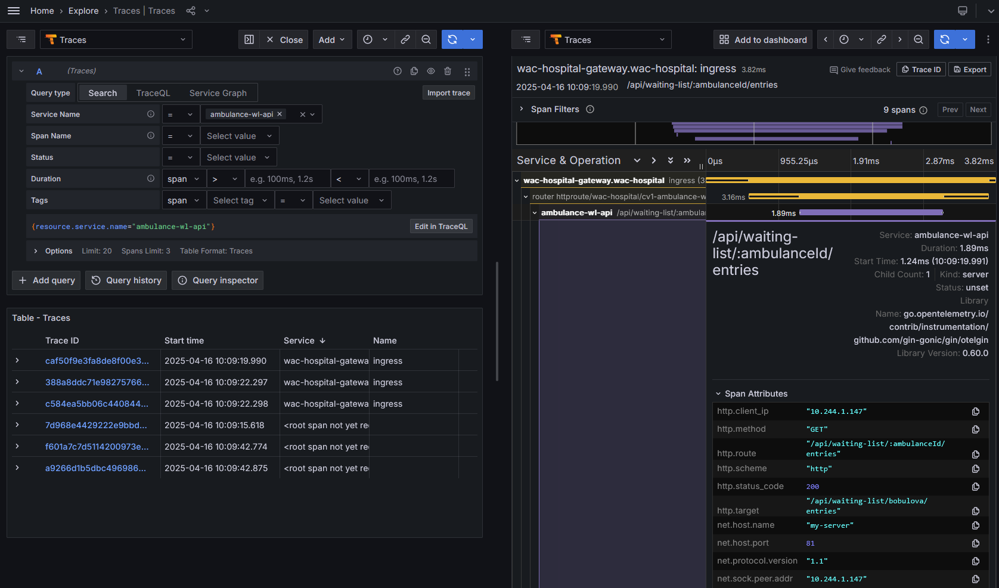

# Distribuované trasovanie

Analýza logov nám výrazne uľahčí sledovanie stavu systému a analýzu prípadných odchýliek od špecifikovaného správania sa systému. Mimo vývojového prostredia, kedy je nasadený systém pod záťažou, sa ale budeme stretávať so situáciami, kedy je potrebné analyzovať, ako prebieha spracovanie jednotlivých požiadaviek skrz viacero mikroslužieb, prípadne budeme potrebovať nájsť príčinu chyby, ktorú pozorujeme až ako zlyhanie požiadavky v niektorej zo služieb, kde už nie je možné vykonať opravnú operáciu. V zásade potrebujeme nájsť vzťah medzi jednotlivými operačnými záznamami - log-mi - v rôznych častiach nášho systému, pričom takýto systém môže simultánne spracovávať desiatky až tisícky požiadaviek. V takomto prostredí často potrebujeme zodpovedať otázky typu:  prečo niektoré operácie trvajú príliš dlho, kde je potenciál na zvýšenie výkonnosti systému, alebo čo je príčinou chyby, ktorá sa prejavuje až pri zápise nesprávnych údajov do externého systému. Nájsť na ne odpovede v generovaných záznamoch môže zdĺhavé a častokrát až nemožné. Alternatívnym prístupom je vytvorenie záznamu, alebo sady záznamov, kde je zanamenané ako na seba jednotlivé operácie nadväzujú, aka je doba spracovania jednotlivých operácii, a aký je výsledný stav týchto operácií a to skrz jednu alebo viacero (mikro)služieb nášho softvérového riešenia. Na rozdiel od klasických záznamov (_logov_), nebude rozlišovať medzi kritickými a nekritickými záznamami, ale zvolime stratégiu zbierania dostatočného počtu detailnych vzoriek, čo umožní získať detailný pohľad na činnosť systému s prijateľným zaťažením na zber týchto údajov. Takémuto zberu údajov sa hovorí distribuované trasovanie - [_distributed tracing_](https://microservices.io/patterns/observability/distributed-tracing.html). Projekt [Open Telemetry](https://opentelemetry.io/) je v súčasnosti najrozšírenejšou špecifikáciou pre zber a analýzu distribuovaných záznamov a možno ho považovať za de facto štandard pre túto funkcionalitu. Open Telemetry je projekt, ktorý vznikol zlúčením projektov [OpenTracing](https://opentracing.io/) a [OpenCensus](https://opencensus.io/). V súčasnosti je projekt Open Telemetry spravovaný organizáciou [Cloud Native Computing Foundation](https://www.cncf.io/), ktorá sa zaoberá rozvojom technológii pre cloud native aplikácie.

Zjednodušene opísané, v kontexte distribuovaného trasovania je požiadavke vstupujúcej do systému (prípadne samostatnej požiadavke vzniknutej v rámci systému samotného) priradený takzvaný _trace-id_, ktorý sa propaguje pri volaniach jednotlivých subsystémov - mikroslužieb, knižníc alebo komponentov mikroslužieb. Každý subsystém potom definuje rozsah výpočtu - [_span_](https://opentelemetry.io/docs/concepts/signals/traces/#spans), ktorému priraďuje príslušné [atribúty](https://opentelemetry.io/docs/concepts/signals/traces/#attributes) potrebné pre identifikáciu služby, typu výpočtu, prípadne parametre výpočtu a udalosti vznikajúce počas výpočtu. _Span_ má priradený [_span context_](https://opentelemetry.io/docs/concepts/signals/traces/#span-context) alebo tiež nazývaný [_trace context_](https://opentelemetry.io/docs/concepts/signals/traces/#span-context). Trace context obsahuje identifikátor pôvodnej požiadavky - _trace_id_ - v ktorej kontexte je výpočet vykonávaný, ako aj rozsah výpočtu - _span-id_, ktoré zahŕňajú príslušný výpočet. Tieto záznamy sú následne odoslané do služby - _collector_ - ktorá tieto záznamy odošle na trvalé uloženie pre neskoršiu analýzu. Pre efektívnu analýzu je potrebné aby sa _trace_id_ a _span_id_ propagovali medzi jednotlivými službami, ktoré sa podieľajú na spracovaní požiadavky. V prípade, že niektorá zo služieb neumožňuje prenos týchto identifikátorov, je potrebné ich do tejto služby doplniť, v opačnom prípade budeme mať v záznamoch medzery, ktoré umožnia len čiastočnú analýzu spracovania požiadavky.

V predchádzajúcej kapitole sme nainštalovali systém [Grafana Stack](https://grafana.com/about/grafana-stack/) a systém  [OpenTelemetry Collector](https://opentelemetry.io/docs/collector/). V súbore `${WAC_ROOT}/ambulance-gitops/clusters/localhost/prepare/kustomization.yaml` sme nastavili vzorkovaciu frekvenciu na hodnotu `always_on`, respektíve 100% vzoriek. Táto hodnota je vhodná pre testovacie a vývojové prostredie, v produkčných sýstemoch býva rádovo v jednotkách percent, tak aby nedošlo k zbytočnému zahlcovaniu systému a zároveň bol zachované dostatočné množstvo vzoriek pre prípadnú analýzu systému. V tejto kapitole doplníme do našej webapi služby generovanie záznamov, ktoré následne budeme analyzovať.

1. V prvom kroku doplníme konfiguráciu pre odosielanie záznamov zo služby [Gateway API](https://gateway-api.sigs.k8s.io/). Vytvorte súbor `${WAC_ROOT}/ambulance-gitops/infrastructure/envoy-gateway/envoy-proxy.yaml` s nasledujúcim obsahom:

   ```yaml
   apiVersion: gateway.envoyproxy.io/v1alpha1
   kind: EnvoyProxy
   metadata:
     name: wac-hospital
     namespace: wac-hospital
   spec:
     logging:
       level:
         default: debug
     telemetry:
       tracing:
         samplingRate: 100 # 100% for development purposes
         provider:
           backendRefs:
           - kind: Service
             name: otel-collector
             namespace: observability
             port: 4317
           type: OpenTelemetry
       metrics:
         sinks:
         - type: OpenTelemetry
           openTelemetry: 
             backendRefs:
             - kind: Service
               name: otel-collector
               namespace: observability
               port: 4317
   ```

   Otvorte súbor `${WAC_ROOT}/ambulance-gitops/infrastructure/envoy-gateway/gateway.yaml` a upravte ho

   ```yaml
   apiVersion: gateway.networking.k8s.io/v1beta1
   kind: Gateway
   metadata:
     name: wac-hospital-gateway
     namespace: wac-hospital
   spec:
     gatewayClassName: wac-hospital-gateway-class
     infrastructure:     @_add_@
       parametersRef:     @_add_@
         group: gateway.envoyproxy.io     @_add_@
         kind: EnvoyProxy     @_add_@
         name: wac-hospital     @_add_@
     listeners:
     ...
   ```

   Doplňte do súboru `${WAC_ROOT}/ambulance-gitops/infrastructure/envoy-gateway/kustomization.yaml`:

   ```yaml
   apiVersion: kustomize.config.k8s.io/v1beta1
   kind: Kustomization
   
   resources:
   - https://github.com/envoyproxy/gateway/releases/download/v1.2.8/install.yaml
   - gateway-class.yaml
   - gateway.yaml
   - envoy-proxy.yaml   @_add_@
   ```

   Archivujte zmeny v repozitári:

   ```ps
    git add .
    git commit -m "distributed tracing"
    git push origin main
    ```

2. V súbore `${WAC_ROOT}/ambulance-webapi/cmd/ambulance-api-service/main.go` doplníme podporu pre distribuované trasovanie. Budeme využívať knižnicu [`autoexport`](https://github.com/open-telemetry/opentelemetry-go-contrib/blob/main/README.md), ktorú je možné konfigurovať pomocou premenných prostredia tak aby sme umožnili export záznam do rôznych systémov, napríklad ak by cieľové prostredie nepodporovalo subsystém [OpenTelemetry Collector] ale starší systém _Jaeger_ alebo _Zipkin_. Zároveň  s pomocou knižnice `otelgin` zabezpečíme aby boli zaznamenané všetky požiadavky spracovávané našou službou a predané informácie o _trace-id_ a _span-id_ do ďalších služieb:

   ```go
   package main
   
   import (
     ...
     "go.opentelemetry.io/contrib/exporters/autoexport"   @_add_@
     "go.opentelemetry.io/contrib/instrumentation/github.com/gin-gonic/gin/otelgin"   @_add_@
     "go.opentelemetry.io/otel"   @_add_@
     "go.opentelemetry.io/otel/propagation"   @_add_@
     tracesdk "go.opentelemetry.io/otel/sdk/trace"   @_add_@
   )
   
   func main() {
     ...
     // Set the global log level
     zerolog.SetGlobalLevel(level)
   
     // initialize trace exporter   @_add_@
     ctx, cancel := context.WithCancel(context.Background())   @_add_@
     traceExporter, err := autoexport.NewSpanExporter(ctx)   @_add_@
     if err != nil {   @_add_@
       log.Fatal().Err(err).Msg("Failed to initialize trace exporter")   @_add_@
     }   @_add_@
      @_add_@
     traceProvider := tracesdk.NewTracerProvider(tracesdk.WithBatcher(traceExporter))   @_add_@
     otel.SetTracerProvider(traceProvider)   @_add_@
     otel.SetTextMapPropagator(propagation.TraceContext{})   @_add_@
   
     log.Info().Msg("Server started")
     ...
     engine := gin.New()
     engine.Use(gin.Recovery())
     engine.Use(otelgin.Middleware("ambulance-webapi"))   @_add_@
     ...
   }
   ```

3. Upravíme súbor `${WAC_ROOT}/ambulance-webapi/internal\db_service\mongo_svc.go`:

   ```go
   package db_service
   
   import (
     ...
     "go.opentelemetry.io/contrib/instrumentation/go.mongodb.org/mongo-driver/mongo/otelmongo"   @_add_@
     "go.opentelemetry.io/otel"   @_add_@
     "go.opentelemetry.io/otel/attribute"   @_add_@
     "go.opentelemetry.io/otel/codes"   @_add_@
     "go.opentelemetry.io/otel/trace"   @_add_@
   )
   type mongoSvc[DocType interface{}] struct {
     MongoServiceConfig
     client     atomic.Pointer[mongo.Client]
     clientLock sync.Mutex
   
     tracer trace.Tracer  @_add_@
   }
   
   func NewMongoService[DocType interface{}](config MongoServiceConfig) DbService[DocType] {
     enviro := func(name string, defaultValue string) string {
       ...
     }
   
     svc := &mongoSvc[DocType]{}
     svc.tracer = otel.Tracer("MongoService") @_add_@
     svc.MongoServiceConfig = config
     ...
   }
   
   func (m *mongoSvc[DocType]) connect(ctx context.Context) (*mongo.Client, error) {
     ctx, span := m.tracer.Start(ctx, "connect") @_add_@
     defer span.End() @_add_@
     // optimistic check
     client := m.client.Load()
     if client != nil {
       return client, nil
     }
   
     m.clientLock.Lock()
     defer m.clientLock.Unlock()
     // pesimistic check
     client = m.client.Load()
     if client != nil {
       return client, nil
     }
   
     ctx, contextCancel := context.WithTimeout(ctx, m.Timeout)
     defer contextCancel()
   
     var uri = fmt.Sprintf("mongodb://%v:%v", m.ServerHost, m.ServerPort)
     span.SetAttributes(attribute.String("mongodb.uri", uri)) @_add_@
     log.Printf("Using URI: " + uri)
   
     if len(m.UserName) != 0 {
       uri = fmt.Sprintf("mongodb://%v:%v@%v:%v", m.UserName, m.Password, m.ServerHost, m.ServerPort)
     }
   
     opts := options.Client()   @_add_@
     opts.Monitor = otelmongo.NewMonitor()   @_add_@
     opts.ApplyURI(uri).SetConnectTimeout(10 * time.Second)   @_add_@
     if client, err := mongo.Connect(ctx, opts); err != nil {   @_add_@
     if client, err := mongo.Connect(ctx, options.Client().ApplyURI(uri).SetConnectTimeout(10*time.Second)); err != nil {  @_remove_@
       span.SetStatus(codes.Error, "MongoDB connection error")
       return nil, err
     } else {
       m.client.Store(client)
       span.SetStatus(codes.Ok, "MongoDB connection established")
       return client, nil
     }
   }
   ```

   Technicky vzaté máme našu službu pripravenú nato aby vytvorila záznam o spracovaní požiadavky a jej predanie na službu mongodb. Tiež sme vytvorili záznam o pripojení k databáze. Pre podrobnejšiu analýzu musíme vytvoriť aj záznamy pre jednotlivé operácie v našej službe. V rovnakom súbore `${WAC_ROOT}/ambulance-webapi/internal\db_service\mongo_svc.go` upravte funkciu `CreateDocument`:

   ```go
   func (m *mongoSvc[DocType]) CreateDocument(ctx context.Context, id string, document *DocType) error {
     ctx, span := m.tracer.Start(  @_add_@
       ctx,  @_add_@
       "CreateDocument",  @_add_@
       trace.WithAttributes(  @_add_@
         attribute.String("mongodb.collection", m.Collection),  @_add_@
         attribute.String("entry.id", id),  @_add_@
       ),  @_add_@
     )  @_add_@
     defer span.End()  @_add_@
   
     ctx, contextCancel := context.WithTimeout(ctx, m.Timeout)
     defer contextCancel()
     client, err := m.connect(ctx)
     if err != nil {
       return err
     }
     db := client.Database(m.DbName)
     collection := db.Collection(m.Collection)
     result := collection.FindOne(ctx, bson.D{{Key: "id", Value: id}})
     switch result.Err() {
   
     case nil: // no error means there is conflicting document
       return ErrConflict
     case mongo.ErrNoDocuments:
       // do nothing, this is expected
     default: // other errors - return them
       span.SetStatus(codes.Error, result.Err().Error()) @_add_@
       return result.Err()
     }
   
     _, err = collection.InsertOne(ctx, document)
     span.SetStatus(codes.Ok, "Document inserted") @_add_@
     return err
   }
   ```

   Obdobne upravte funkciu `FindDocument`:

   ```go
   func (m *mongoSvc[DocType]) FindDocument(ctx context.Context, id string) (*DocType, error) {
     ctx, span := m.tracer.Start(   @_add_@
       ctx,   @_add_@
       "CreateDocument",   @_add_@
       trace.WithAttributes(   @_add_@
         attribute.String("mongodb.collection", m.Collection),   @_add_@
         attribute.String("entry.id", id),   @_add_@
       ),   @_add_@
     )   @_add_@
     defer span.End()   @_add_@
     ctx, contextCancel := context.WithTimeout(ctx, m.Timeout)
     defer contextCancel()
     client, err := m.connect(ctx)
     if err != nil {
       return nil, err
     }
     db := client.Database(m.DbName)
     collection := db.Collection(m.Collection)
     result := collection.FindOne(ctx, bson.D{{Key: "id", Value: id}})
     switch result.Err() {
     case nil:
     case mongo.ErrNoDocuments:
       span.SetStatus(codes.Error, "Document not found")   @_add_@
       return nil, ErrNotFound
     default: // other errors - return them
       return nil, result.Err()
     }
     var document *DocType
     if err := result.Decode(&document); err != nil {
       span.SetStatus(codes.Error, "Document decode error")   @_add_@
       return nil, err
     }
     span.SetStatus(codes.Ok, "Document found")   @_add_@
     return document, nil
   }
   ```

   a funkciu `UpdateDocument`:

   ```go
   func (m *mongoSvc[DocType]) UpdateDocument(ctx context.Context, id string, document *DocType) error {
     ctx, span := m.tracer.Start(
       ctx,
       "CreateDocument",
       trace.WithAttributes(
         attribute.String("mongodb.collection", m.Collection),
         attribute.String("entry.id", id),
       ),
     )
     defer span.End()
   
     ctx, contextCancel := context.WithTimeout(ctx, m.Timeout)
     defer contextCancel()
   
     client, err := m.connect(ctx)
     if err != nil {
       return err
     }
     db := client.Database(m.DbName)
     collection := db.Collection(m.Collection)
     result := collection.FindOne(ctx, bson.D{{Key: "id", Value: id}})
     switch result.Err() {
     case nil:
     case mongo.ErrNoDocuments:
       span.SetStatus(codes.Error, "Document not found")
       return ErrNotFound
     default: // other errors - return them
       span.SetStatus(codes.Error, result.Err().Error())
       return result.Err()
     }
     _, err = collection.ReplaceOne(ctx, bson.D{{Key: "id", Value: id}}, document)
     return err
   }
   ```

   Všetky tri funkcie sme doplnili o vytvorenie _span_ záznamu a priradenie atribútov, ktoré budú súčasťou záznamu. Explicitné nastavenie výsledku operácie  - `SetStatus` nie je povinné, ale najme pri chybových stavoch nám pomôže rýchlejšie identifikovať možný zdroj problému. AKo ste si všimli, _trace context_, teda `trace-id` a `span-id` sú predavané medzi operáciu pomocou argumentu typu _context.Context_. Tento kontext je možné predávať medzi jednotlivými operáciami a tak zabezpečiť, že všetky operácie vykonávané v rámci jedného _trace_ budú mať rovnaký _trace-id_ a správnu hierarchiu _span-id_.

4. Ako ukážku doplníme distribuované záznamy do niekoľkých metód v súbore `${WAC_ROOT}/ambulance-webapi/internal/ambulance_wl/impl_ambulance_waiting_list.go`. Najpr upravíme inicializáciu typu `implAmbulanceWaitingListAPI`:

   ```go
   package ambulance_wl
   
   import (
     ...
     "go.opentelemetry.io/otel"   @_add_@
     "go.opentelemetry.io/otel/codes"   @_add_@
     "go.opentelemetry.io/otel/trace"   @_add_@
   )
   
   type implAmbulanceWaitingListAPI struct {
     logger zerolog.Logger
     tracer trace.Tracer  @_add_@
   }
   
   func NewAmbulanceWaitingListApi() AmbulanceWaitingListAPI {
     return &implAmbulanceWaitingListAPI{
       logger: log.With().Str("component", "ambulance-wl").Logger(),
       tracer: otel.Tracer("ambulance-wl"),   @_add_@
     }
   }
   ```

   Z historických dôvodov sú v type `gin.Context` prenášané dva kontexty - samotný `gin.Context` a tiež context uložený v premennej `gin.Context.Request.Context()`. Z dôvodu kompatibility so štandardnými a novšími knižnicami jazyka golang, potrebujeme nastaviť _trace context_ v druhom z týchto kontextov. Upravte metódu `CreateWaitingList` nasledujúcim spôsobom:

   ```go
   func (o implAmbulanceWaitingListAPI) CreateWaitingListEntry(c *gin.Context) {
     ctx, span := o.tracer.Start(c.Request.Context(), "CreateWaitingListEntry")   @_add_@
     defer span.End()   @_add_@
     // update request context to build span hierarchy accross calls and services   @_add_@
     c.Request = c.Request.WithContext(ctx)   @_add_@
   
     updateAmbulanceFunc(c, func(c *gin.Context, ambulance *Ambulance) (*Ambulance, interface{}, int) {
       ctx, span := o.tracer.Start(c.Request.Context(), "CreateWaitingListEntry-updateAmbulanceFunc")   @_add_@
       defer span.End()   @_add_@
       // update context to build span hierarchy accross calls   @_add_@
       c.Request = c.Request.WithContext(ctx)   @_add_@
   
       logger := o.logger.With().
         Str("method", "CreateWaitingListEntry").
         Str("ambulanceId", ambulance.Id).
         Str("ambulanceName", ambulance.Name).
         Logger()
       var entry WaitingListEntry
   
       if err := c.ShouldBindJSON(&entry); err != nil {
         logger.Error().Err(err).Msg("Failed to bind JSON")
         span.SetStatus(codes.Error, "Failed to bind JSON")   @_add_@
         return nil, gin.H{
           "status":  http.StatusBadRequest,
           "message": "Invalid request body",
           "error":   err.Error(),
         }, http.StatusBadRequest
       }
   
       if entry.PatientId == "" {
         logger.Error().Msg("Patient ID is required")
         span.SetStatus(codes.Error, "Patient ID is required")   @_add_@
         logger.Trace().Msgf("Entry: %+v", entry)
         return nil, gin.H{
           "status":  http.StatusBadRequest,
           "message": "Patient ID is required",
         }, http.StatusBadRequest
       }
   
       if entry.Id == "" || entry.Id == "@new" {
         entry.Id = uuid.NewString()
         logger.Debug().
           Str("entry-id", entry.Id).
           Msg("Generating new ID for entry")
       }
   
       conflictIndx := slices.IndexFunc(ambulance.WaitingList, func(waiting WaitingListEntry) bool {
         return entry.Id == waiting.Id || entry.PatientId == waiting.PatientId
       })
   
       if conflictIndx >= 0 {
         logger.Error().Msg("Entry already exists")
         span.SetStatus(codes.Error, "Entry already exists")   @_add_@
         return nil, gin.H{
           "status":  http.StatusConflict,
           "message": "Entry already exists",
         }, http.StatusConflict
       }
   
       ambulance.WaitingList = append(ambulance.WaitingList, entry)
       ambulance.reconcileWaitingList()
       // entry was copied by value return reconciled value from the list
       entryIndx := slices.IndexFunc(ambulance.WaitingList, func(waiting WaitingListEntry) bool {
         return entry.Id == waiting.Id
       })
       if entryIndx < 0 {
         logger.Error().Msg("Failed to find entry in waiting list after saving")
         span.SetStatus(codes.Error, "Failed to find entry in waiting list after saving")   @_add_@
         return nil, gin.H{
           "status":  http.StatusInternalServerError,
           "message": "Failed to save entry",
         }, http.StatusInternalServerError
       }
       logger.Info().
         Str("patient-id", ambulance.WaitingList[entryIndx].Id).
         Msg("Succesfully created patient entry")
       span.SetStatus(codes.Ok, "Succesfully created patient entry")   @_add_@
       return ambulance, ambulance.WaitingList[entryIndx], http.StatusOK
     })
   }
   ```

   >homework:> Obdobným postupom doplňte distribuované trasovanie aj do ostatných metód.

   Otvorte súbor `${WAC_ROOT}/ambulance-webapi/internal/ambulance_wl/impl_ambulance_waiting_list_test.go` a upravte test `Test_UpdateWl_DbServiceUpdateCalled`:

   ```go
   package ambulance_wl
   
   import (
     ...
     "github.com/rs/zerolog"   @_add_@
     "go.opentelemetry.io/otel/trace/noop"   @_add_@
   )
   ...
   func (suite *AmbulanceWlSuite) Test_UpdateWl_DbServiceUpdateCalled() {
     // ARRANGE
     ...
   
     sut := implAmbulanceWaitingListAPI{
       tracer: noop.NewTracerProvider().Tracer("ambulance-wl"),   @_add_@
       logger: zerolog.Nop(),   @_add_@
     }
     // ACT
     sut.UpdateWaitingListEntry(ctx)
     // ASSERT
     suite.dbServiceMock.AssertCalled(suite.T(), "UpdateDocument", mock.Anything, "test-ambulance", mock.Anything)
   }
   ```

5. Aby bola štruktúra záznamu kompletná upravíme ešte súbor  `${WAC_ROOT}/ambulance-webapi/internal/ambulance_wl/utils_ambulance_updater.go`:

   ```go
   package ambulance_wl
   
   import (
     ...
     "go.opentelemetry.io/otel"   @_add_@
     "go.opentelemetry.io/otel/codes"   @_add_@
   )
   
   type ambulanceUpdater = func(
     ctx *gin.Context,
     ambulance *Ambulance,
   ) (updatedAmbulance *Ambulance, responseContent interface{}, status int)
   
   func updateAmbulanceFunc(ctx *gin.Context, updater ambulanceUpdater) {
     tracer := otel.Tracer("ambulance-wl")   @_add_@
     spanCtx, span := tracer.Start(ctx.Request.Context(), "updateAmbulanceFunc")   @_add_@
     defer span.End()   @_add_@
      @_add_@
     ctx.Request = ctx.Request.WithContext(spanCtx)   @_add_@
   
     value, exists := ctx.Get("db_service")
     if !exists {
       span.SetStatus(codes.Error, "db_service not found")   @_add_@
       ctx.JSON(
         http.StatusInternalServerError,
         gin.H{
           "status":  "Internal Server Error",
           "message": "db_service not found",
           "error":   "db_service not found",
         })
       return
     }
   
     db, ok := value.(db_service.DbService[Ambulance])
     if !ok {
       span.SetStatus(codes.Error, "db_service context is not of type db_service.DbService")   @_add_@
       ctx.JSON(
         http.StatusInternalServerError,
         gin.H{
           "status":  "Internal Server Error",
           "message": "db_service context is not of type db_service.DbService",
           "error":   "cannot cast db_service context to db_service.DbService",
         })
       return
     }
   
     ambulanceId := ctx.Param("ambulanceId")
     ambulance, err := db.FindDocument(ctx.Request.Context(), ambulanceId)
   
     switch err {
     case nil:
       // continue
     case db_service.ErrNotFound:
       span.SetStatus(codes.Error, "Ambulance not found")   @_add_@
       ctx.JSON(
         http.StatusNotFound,
         gin.H{
           "status":  "Not Found",
           "message": "Ambulance not found",
           "error":   err.Error(),
         },
       )
       return
     default:
       span.SetStatus(codes.Error, "Failed to load ambulance from database")   @_add_@
       ctx.JSON(
         http.StatusBadGateway,
         gin.H{
           "status":  "Bad Gateway",
           "message": "Failed to load ambulance from database",
           "error":   err.Error(),
         })
       return
     }
   
     if !ok {
       span.SetStatus(codes.Error, "Failed to cast ambulance from database")   @_add_@
       ctx.JSON(
         http.StatusInternalServerError,
         gin.H{
           "status":  "Internal Server Error",
           "message": "Failed to cast ambulance from database",
           "error":   "Failed to cast ambulance from database",
         })
       return
     }
   
     updatedAmbulance, responseObject, status := updater(ctx, ambulance)
   
     if updatedAmbulance != nil {
       err = db.UpdateDocument(ctx.Request.Context(), ambulanceId, updatedAmbulance)
     } else {
       err = nil // redundant but for clarity
     }
   
     switch err {
     case nil:
       span.SetStatus(codes.Ok, "Ambulance updated")   @_add_@
       if responseObject != nil {
         ctx.JSON(status, responseObject)
       } else {
         ctx.AbortWithStatus(status)
       }
     case db_service.ErrNotFound:
       span.SetStatus(codes.Error, "Ambulance not found")   @_add_@
       ctx.JSON(
         http.StatusNotFound,
         gin.H{
           "status":  "Not Found",
           "message": "Ambulance was deleted while processing the request",
           "error":   err.Error(),
         },
       )
     default:
       span.SetStatus(codes.Error, "Failed to update ambulance in database")   @_add_@
       ctx.JSON(
         http.StatusBadGateway,
         gin.H{
           "status":  "Bad Gateway",
           "message": "Failed to update ambulance in database",
           "error":   err.Error(),
         })
     }
   }
   ```

   Ako ste si všimli, doplnenie informácií, ktoré sú potrebné pre analýzu činnosti systému vyžaduje množstvo drobných úprav. Ich doplnenie v neskorších fázach vývoja môže byť problematické, preto je dobré mať na pamäti, že záznamy o činnosti systému sú dôležité a mali by byť súčasťou návrhu systému, doplnené hneď pri implementácii danej funkcionality a byť podrobené kontrole kvality počas kontroly - _review_ - kódu. Bez ich prítomnosti je efektívna analýza a optimalizácia distribuovaného systému takmer nemožná.

   >homework:> Obdobným spôsobom doplňte trasovanie aj do ostatných častí kódu.

6. Uložte všetky zmeny a skontrolujte, že je kód stále funkčný. V priečinku  `${WAC_ROOT}/ambulance-webapi vykonajte príkazy:

   ```ps
   go mod tidy
   go build .\cmd\ambulance-api-service\main.go
   go test ./...
   ```

   Následne archivujte zmeny a počkajte kym sa nová verziu obrazu `ambulance-webapi` nasadí vo vašom lokálnom klastri:

   ```ps
    git add .
    git commit -m "distributed tracing"
    git push origin main
    ```

7. Prejdite na stránku [http://localhost]([http://localhost]) a v aplikácii _Zoznam čakajúcich <pfx>_ vytvorte niekoľko záznamov. Otvorte aplikáciu _Aktuálny operačný stav systému_ (_Grafana_) a otvorte navigačný panel. Zvoľte záložku _Explore_ a v ľavej hornej časti zvoľte v rozbaľovacom okne položku _Traces_. V riadku _Query Type_ stlačte tlačidlo _Search_ a potom v riadku _Service Name_ zvoľte `ambulance_wl_api`. V pravom hornom rohu stačte modro sfarbené tlačidlo _Run query_.

   V tabuľke _Traces_ zvoľte niektorý zo záznamov pomenovaných `wac-hospital-gateway.wac-hospital` a v panely ktorý sa nasledne otvorí ho podrobte analýze. Zodpovedá čas operácií Vašim očakávaniam? Ktorej operácii, ambulancii, a záznamu v zozname čakajúcich tento záznam o činnosti systému zodpovedá?

   

   Zoznámte sa s používateľskym rozhraním, a jeho možnosťami. Ako by ste vyhľadali a analyzovali záznamy pri sporadických výpadkoch alebo problémoch s výkonom? Aké ďalšie informácie by ste do záznamov doplnili aby ste uľahčili analýzu?

>homework:> Vytvorte nové vydanie mikroslužby a nasaďte ho do spločného klastra. Vyskúšajte analyzovať zázname ktoré sú na spoločnom klastri dostupné.
