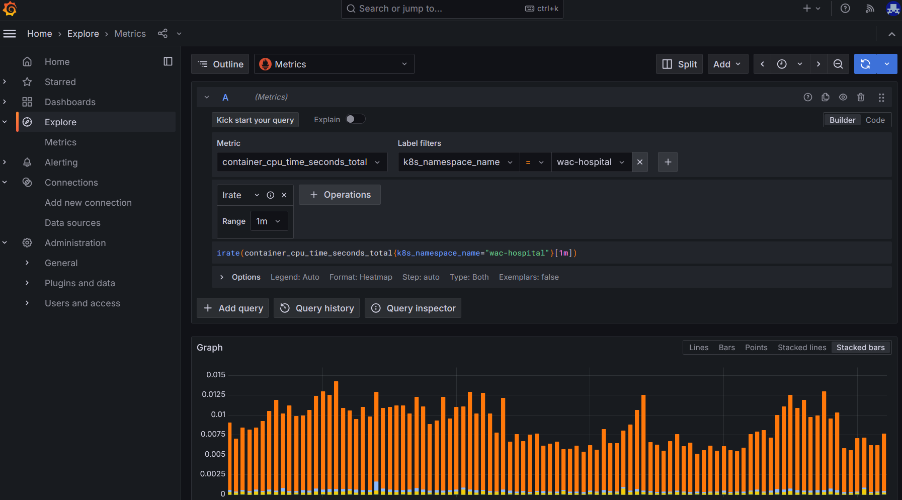
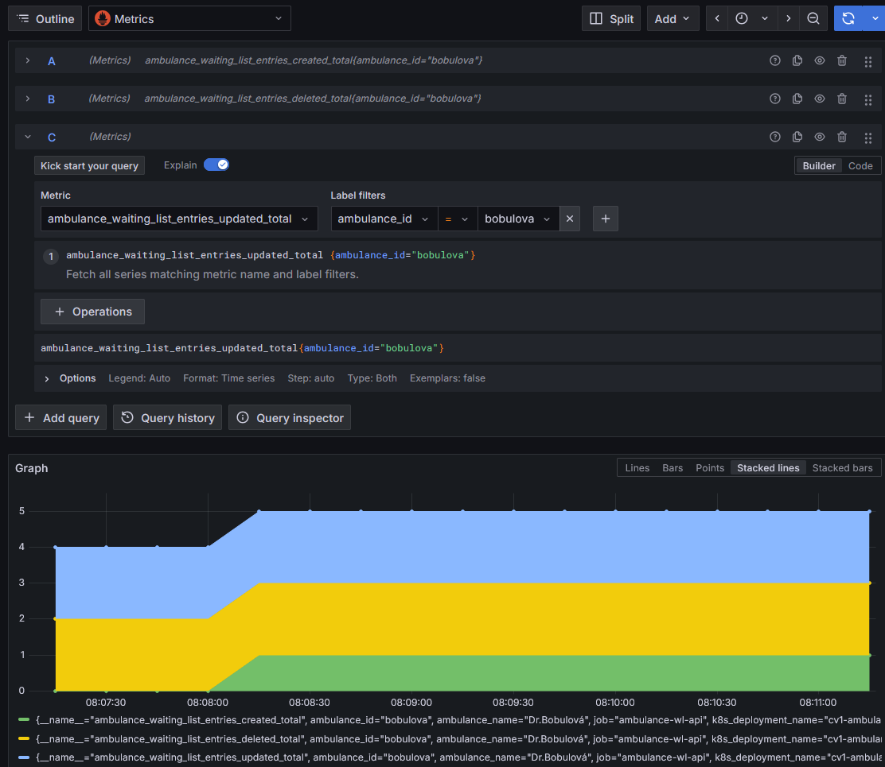

# Sledovanie stavu systému pomocou metrík

Pokiaľ sú naše logy a distribuované trasovanie vhodne vytvorené, môžeme z nich okrem analýzy problémov získať aj dostatok informácií o aktuálnom stave systému. Tieto záznamy ale primárne neriešia túto úlohu a vo väčšine prípadov nie sú najvhodnejším spôsobom na sledovanie rôznych výkonových parametrov systému a iných metrík systému, najmä pokiaľ sa jedná o agregované údaje.  V tejto časti si ukážeme, ako náš systém obohatiť o zber metrík formou časových sérií aktuálneho stavu systému. Stále vychádzame z toho, že máme nainštalovaný [Grafana Stack] a [OpenTelemetry Collector] z kapitoly [Zber a analýza logov](./080-log-analytics.md), ktorých konfigurácie už poskytuje základné metriky o našom klastri a službách v ňom bežiacich.

1. Predpokladajme, že by sme chceli zistiť kedy su najviac vyťažené naše služby (_CPU Utilization_), ktoré bežia v _namespace_ `wac-hospital`. V prehliadači otvorte stránku [http://localhost](http:localhost), otvorte navigačný panel a zvoľte záložku _Explore_. V ľavom hornom rohu vyberte ako zdroj údajov `Metrics`. V poli _Metric_ zvoľte hodnotu `container_cpu_time_seconds_total`, v poli _Label filters_ zvoľte hodnotu `k8s_namespace_name` a do poľa _Value_ zadajte hodnotu `wac-hospital`. Stlačte tlačidlo _Operations_ a zvoľte funkciu _Range Functions-->Irate_, v poli _Range_ potom zadajte hodnotu `1m`. V pravom hornom rohu stlačte modro sfarbené tlačidlo _Run Query_.

   V spodnej časti obrazovky sa zobrazí graf, ktorý zobrazuje spotrebu CPU času v minútových intervaloch. Pretože väčšina metrík je kumulatívna, tzn. že uložené hodnoty sú kumulované za celkový čas od kedy došlo k meraniu - informujúce napríklad že daný kontajner celkovo spotreboval 10 sekúnd CPU a v ďalšom meraní 11 (10+1) sekúnd, potom 14 (11+3) sekúnd, atď, použili sme funkciu IRate ktorá tieto kumulatívne hodnoty prevedie do zmien hodnoty za dané časové obdobie.

   

   >keyboard:> Zoznámte sa s používateľským rozhraním sledovanie metrík v [Grafana Stack] a pokúste sa získať ďalšie metriky, ktoré sú pre vás zaujímavé. Vyskúšajte rôzne funkcie a agregácie, ktoré sú dostupné v [Grafana Stack]. Podrobnejšie informácie o dostupných funkciách a agregáciách nájdete v [dokumentácii Grafana](https://grafana.com/docs/grafana/latest/datasources/prometheus/query-editor).

Mnoho relevantných metrík už je zozbieraných a sprístupnených automaticky. Niekedy ale potrebujeme získať metriky ktoré sú špecifické pre náš softverový systém. Napríklad v našom prípade je zaujíma mať prehľad o priepustnosti systému vo vzťahu k množstvu spracovaných pacientskych záznamov. Bolo by dobré vedieť koľko nových záznamov je v našej aplikácií vytváraných, koľko ich je zmenených a koľko je vymazaných. Tieto metriky sú pre nás dôležité, pretože nám dávajú predstavu o tom, ako sa náš systém správa a akú záťaž naň kladieme.

>info:> Je vhodné oddeliť metriky technického charakteru od obchodných metrík a ukazovateľov výkonnosti. Technické metriky sú zamerané na technické aspekty systému, ako je napríklad vyťaženie CPU, pamäte, diskov, množstvo spracovaných požiadaviek a podobne. Ovplyvňujú technické riešenie softvérového systému. Obchodné metriky sú zamerané na obchodné aspekty organizácie, ako je napríklad počet spracovaných objednávok, počet ošetrených pacientov, čakacie doby v ambulanciach a podobne. Tieto metriky ovplyvňujú obchodné rozhodovanie a sú dôležité pre manažment a obchodné oddelenia. Keďže cielová skupiny oboch metrík je odlišná, obchodné metriky sa zaraďujú medzi funkčné požiadavky systému, zatiaľ čo technické metriky medzi nefunkčné požiadavky systému a sú súčasťou architektúry systému a kvalitatívnym parametrom riešenia. Napriek tomu sa tieto druhy metrík prelínajú a vzájomne ovplyvňujú, neexistuje preto jednoznačna hranica medzi nimi.

1. V prvom kroku pripravíme našu mikroslužbu `ambulance_webapi` na zber metrík. Otvorte súbor `${WAC_ROOT}/ambulance-webapi/cmd/ambulance-api-service/main.go` a doplňte ho o nasledujúci kód:

   ```go
   package main
   
   import (
     ...
     metricsdk "go.opentelemetry.io/otel/sdk/metric" @_add_@
   )
   
   func main() {
     ...
     defer traceProvider.Shutdown(ctx)
   
     // initialize metric exporter
     metricReader, err := autoexport.NewMetricReader(ctx)   @_add_@
     if err != nil {   @_add_@
       log.Fatal().Err(err).Msg("Failed to initialize metric reader")   @_add_@
     }   @_add_@
     metricProvider := metricsdk.NewMeterProvider(metricsdk.WithReader(metricReader))   @_add_@
     otel.SetMeterProvider(metricProvider)   @_add_@
     defer metricProvider.Shutdown(ctx)   @_add_@
   
     log.Info().Msg("Server started")
     ...
   }
   ```

2. V súbore `${WAC_ROOT}/ambulance-webapi/internal/ambulance_wl/impl_ambulance_waiting_list.go` upravte typ `implAmbulanceWaitingListAPI` o nové metriky, ktoré budeme sledovať:

   ```go
   package ambulance_wl
   
   import (
     ...
     "go.opentelemetry.io/otel/attribute"  @_add_@
     "go.opentelemetry.io/otel/metric"  @_add_@
   )
   
   type implAmbulanceWaitingListAPI struct {
     logger                zerolog.Logger
     tracer                trace.Tracer
     entriesCreatedCounter metric.Int64Counter  @_add_@
     entriesUpdatedCounter metric.Int64Counter  @_add_@
     entriesDeletedCounter metric.Int64Counter  @_add_@
   }
   
   func NewAmbulanceWaitingListApi() AmbulanceWaitingListAPI {
     meter := otel.Meter("ambulance-wl")     @_add_@
        @_add_@
     entriesCreatedCounter, err := meter.Int64Counter(     @_add_@
       "ambulance_waiting_list_entries_created_total",     @_add_@
       metric.WithDescription("Total number of entries created in the waiting list API"),     @_add_@
     )     @_add_@
        @_add_@
     if err != nil {     @_add_@
       panic(err)     @_add_@
     }     @_add_@
        @_add_@
     entriesUpdatedCounter, err := meter.Int64Counter(     @_add_@
       "ambulance_waiting_list_entries_updated_total",     @_add_@
       metric.WithDescription("Total number of entries updated in the waiting list API"),     @_add_@
     )     @_add_@
     if err != nil {     @_add_@
       panic(err)     @_add_@
     }     @_add_@
        @_add_@
     entriesDeletedCounter, err := meter.Int64Counter(     @_add_@
       "ambulance_waiting_list_entries_deleted_total",     @_add_@
       metric.WithDescription("Total number of entries deleted in the waiting list API"),     @_add_@
     )     @_add_@
     if err != nil {     @_add_@
       panic(err)     @_add_@
     }     @_add_@
   
     return &implAmbulanceWaitingListAPI{
       logger:                log.With().Str("component", "ambulance-wl").Logger(),
       tracer:                otel.Tracer("ambulance-wl"),
       entriesCreatedCounter: entriesCreatedCounter,     @_add_@
       entriesUpdatedCounter: entriesUpdatedCounter,     @_add_@
       entriesDeletedCounter: entriesDeletedCounter,     @_add_@
     }
   }
   ```

   V našom prípade budeme používať len jednoduché celočíselne počítadla, ďalšie dostupné nástroje môžete nájsť v popise rozhrania [metric.Meter](https://pkg.go.dev/go.opentelemetry.io/otel/metric#Meter).

   Ďalej doplníme do príslušných funkcii volania, ktoré zväčšia hodnotu príslušného počítadla o 1. V tom istom súbore vykonajte zmeny:

   ```go
   func (o implAmbulanceWaitingListAPI) CreateWaitingListEntry(c *gin.Context) {
     ctx, span := o.tracer.Start(c.Request.Context(), "CreateWaitingListEntry")
     defer span.End()
     // update request context to build span hierarchy accross calls and services
     c.Request = c.Request.WithContext(ctx)
   
     updateAmbulanceFunc(c, func(c *gin.Context, ambulance *Ambulance) (*Ambulance, interface{}, int) {
      ...
       span.SetStatus(codes.Ok, "Succesfully created patient entry")
       o.entriesCreatedCounter.Add(   @_add_@
         c.Request.Context(), 1,   @_add_@
         metric.WithAttributes(   @_add_@
           attribute.String("ambulance_id", ambulance.Id),   @_add_@
           attribute.String("ambulance_name", ambulance.Name),   @_add_@
         ),   @_add_@
       )      @_add_@
       return ambulance, ambulance.WaitingList[entryIndx], http.StatusOK
     })
   }

   func (o implAmbulanceWaitingListAPI) DeleteWaitingListEntry(c *gin.Context) {
     updateAmbulanceFunc(c, func(c *gin.Context, ambulance *Ambulance) (*Ambulance, interface{}, int) {
       ..
       o.entriesDeletedCounter.Add(   @_add_@
         c.Request.Context(), 1,   @_add_@
         metric.WithAttributes(   @_add_@
           attribute.String("ambulance_id", ambulance.Id),   @_add_@
           attribute.String("ambulance_name", ambulance.Name),   @_add_@
         ),   @_add_@
       )   @_add_@
       return ambulance, nil, http.StatusNoContent
     })
   }

   ...
   func (o implAmbulanceWaitingListAPI) UpdateWaitingListEntry(c *gin.Context) {
     ctx, span := o.tracer.Start(c.Request.Context(), "CreateWaitingListEntry")
     defer span.End()
     // update request context to build span hierarchy accross calls and services
     c.Request = c.Request.WithContext(ctx)
     updateAmbulanceFunc(c, func(c *gin.Context, ambulance *Ambulance) (*Ambulance, interface{}, int) {
       ...
       o.entriesUpdatedCounter.Add(   @_add_@
         c.Request.Context(), 1,   @_add_@
         metric.WithAttributes(   @_add_@
           attribute.String("ambulance_id", ambulance.Id),   @_add_@
           attribute.String("ambulance_name", ambulance.Name),   @_add_@
         ),   @_add_@
       )   @_add_@
       return ambulance, ambulance.WaitingList[entryIndx], http.StatusOK
     })
   }
   ```

   Nakoniec v súbore `${WAC_ROOT}/ambulance-webapi/internal/ambulance_wl/impl_ambulance_waiting_list_test.go` upravte testy:

   ```go
   package ambulance_wl
   
   import (
     ...
     metricNoop "go.opentelemetry.io/otel/metric/noop"   @_add_@
   )
   ...
   func (suite *AmbulanceWlSuite) Test_UpdateWl_DbServiceUpdateCalled() {
     ...
   
     sut := implAmbulanceWaitingListAPI{
       tracer:                noop.NewTracerProvider().Tracer("ambulance-wl"),
       logger:                zerolog.Nop(),
       entriesCreatedCounter: metricNoop.Int64Counter{},   @_add_@
       entriesUpdatedCounter: metricNoop.Int64Counter{},   @_add_@
       entriesDeletedCounter: metricNoop.Int64Counter{},   @_add_@
     }
     // ACT
     sut.UpdateWaitingListEntry(ctx)
     // ASSERT
     suite.dbServiceMock.AssertCalled(suite.T(), "UpdateDocument", mock.Anything, "test-ambulance", mock.Anything)
   }
   ```

3. Uložte všetky zmeny a skontrolujte, že je kód stále funkčný. V priečinku `${WAC_ROOT}/ambulance-webapi vykonajte príkazy:
  
   ```ps
   go mod tidy
   go build .\cmd\ambulance-api-service\main.go
   go test ./...
   ```

   Následne archivujte zmeny a počkajte kym sa nová verziu obrazu `ambulance-webapi` nasadí vo vašom lokálnom klastri:

   ```ps
     git add .
     git commit -m "metrics"
     git push origin main
   ```

4. Prejdite na stránku [http://localhost]([http://localhost]) a v aplikácii _Zoznam čakajúcich <pfx>_ vytvorte, upravte a vymažte  niekoľko záznamov. Otvorte aplikáciu _Aktuálny operačný stav systému_ (_Grafana_) a otvorte navigačný panel. Zvoľte záložku _Explore_ a v ľavej hornej časti zvoľte v rozbaľovacom okne položku _Metrics_. V poli _Metric_ zvoľte hodnotu `ambulance_waiting_list_entries_created_total`, v poli _Label filters_ zvoľte hodnotu `ambulance_id` a do poľa _Value_ zadajte hodnotu `bobulova`. Stlačte tlačidlo _Add Query_ a v novom panely zvoľte hodnotu `ambulance_waiting_list_entries_updated_total`, v poli _Label filters_ zvoľte hodnotu `ambulance_id` a do poľa _Value_ zadajte hodnotu `bobulova`. Opäť stlačte tlačidlo _Add Query_ a v novom panely zvoľte hodnotu `ambulance_waiting_list_entries_deleted_total`, v poli _Label filters_ zvoľte hodnotu `ambulance_id` a do poľa _Value_ zadajte hodnotu `bobulova`. Stlačte tlačidlo _Run Query_. 

   V spodnej časti obrazovky sa zobrazí graf, ktorý zobrazuje počet vytvorených, upravených a vymazaných záznamov čakajúcich pacientov. V hornom rohu grafu môžete zmeniť spôsob zobrazenie napríklad na _Stacked lines_. 

   

Touto kapitolou sme ukončili tému sledovania stavu systému, alebo observability. V kóde sme museli pridali volania potrebné pre získanie relevantných informácií. Je dôležité aby tento kód bol dostupný ešte predtým ako sa systém nasadí a vyskytnú sa v ňom prípadne problémy. Pri návrhu systému je preto dôležité zohľadniť aj kvalitativé požiadavky na systém a adresovať ich čo najskôr počas vývoja systému. 

>local_library:> Zoznámte sa zo základnými pojmami v štandarde [ISO/IEC 25002 Systems and software engineering — Systems and software Quality Requirements and Evaluation](https://en.wikipedia.org/wiki/ISO/IEC_9126#Developments). Ako vy ste jednotlivé kvalitatívne požiadavky adresovali vo vašich projektoch?